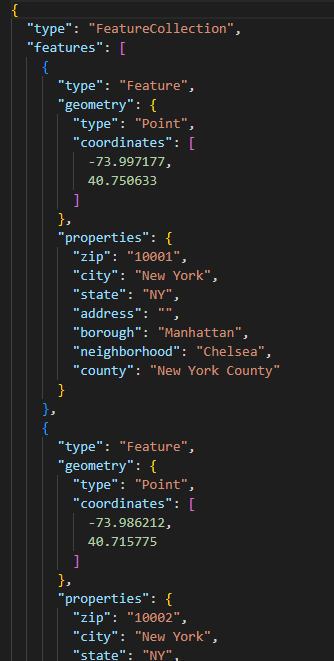

# Lab-09---LINQ
Provided is a JSON file that contains a data set of location information for properties in Manhattan.

## Summary
Provided is a JSON file that contains a data set of location information for properties in Manhattan.

## Questions
1. Output all of the neighborhoods in this data list (Final Total: 147 neighborhoods)
2. Filter out all the neighborhoods that do not have any names (Final Total: 143)

3. Remove the duplicates (Final Total: 39 neighborhoods)

4. Rewrite the queries from above and consolidate all into one single query.

5. Rewrite at least one of these questions only using the opposing method (example: Use LINQ Query statements instead of LINQ method calls and vice versa.)

### The OUTPUT CONSOLE IS 

